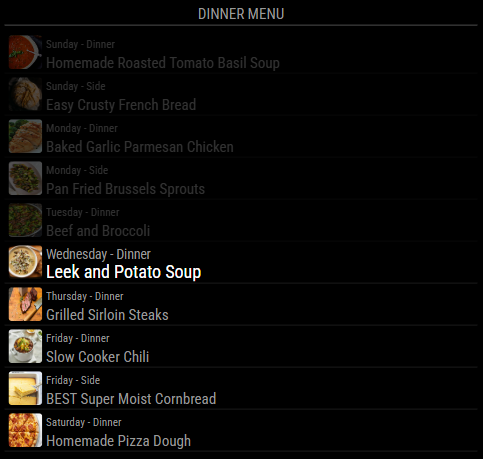

# MMM-MealieMenu 

[](https://github.com/zanix/MMM-MealieMenu/issues)
[](https://github.com/zanix/MMM-MealieMenu/pulls)
[](https://github.com/zanix/MMM-MealieMenu/network)
[](https://github.com/zanix/MMM-MealieMenu/stargazers)
[](https://github.com/zanix/MMM-MealieMenu/blob/master/LICENSE)

[](https://github.com/zanix/MMM-MealieMenu/actions/workflows/automated-tests.yaml)
[](https://github.com/zanix/MMM-MealieMenu/commits/main)
[](https://github.com/zanix/MMM-MealieMenu/commits/main)

**MMM-MealieMenu is a module for [MagicMirror²](https://github.com/MagicMirrorOrg/MagicMirror) that displays your [Mealie](https://mealie.io) meal plan for the week.**

## Description

This module shows your meal plan from [Mealie](https://mealie.io/).

Mealie is an intuitive and easy to use recipe management app. It's designed to make your life easier by being the best recipes management experience on the web and providing you with an easy to use interface to manage your growing collection of recipes.

Mealie is self-hostable, meaning you can run it on your own server without any reliance on cloud-services.

## How it Works

After you installed MMM-MealieMenu you just configure it to your needs and that's it. You will need to provide the Mealie `host` and credentials as an `apiKey` or `username` & `password`.

For more information see the [Configuration](#configuration) section.

## Screenshots

<!-- prettier-ignore-start -->

<!-- prettier-ignore-end -->

## Installation

Just clone the module into your modules folder of your MagicMirror² and execute `npm install` in the module’s directory:

```bash
cd ~/MagicMirror/modules
git clone https://github.com/zanix/MMM-MealieMenu
cd MMM-MealieMenu
npm install --omit=dev
```

## Update

Go to the module’s folder inside MagicMirror modules folder and pull the latest version from GitHub and install:

```bash
cd ~/MagicMirror/modules/MMM-MealieMenu
git pull
npm install --omit=dev
```

Restart MagicMirror after updating.

## Configuration

The module is quite configurable. The only required options are `host`, `apiKey` (or `username`/`password`) - all other options are **optional**.

These are the possible options:

<!-- prettier-ignore-start -->
| Option                          | Description    |
|---------------------------------|----------------|
| `host`                          | <p>The URL to your Mealie instance.</p><p>**REQUIRED**<br>**Type:** `string`<br>**Example:** `"https://mealie.yourdomain.com"`<br>**Default value:** none</p>|
| `apiKey`                        | <p>An API key generated from a user profile in Mealie.</p><p>**REQUIRED** When not using username and password<br>**Type:** `string`<br>**Example:** `"eyhJbcG..."`<br>**Default value:** none</p><p>**Note:** You can generate a key by going to your user profile in Mealie then to API Tokens link (or using this path `/user/profile/api-tokens`).</p>|
| `username`                      | <p>The username/email for your Mealie account.</p><p>**REQUIRED** When not using `apiKey`<br>**Type:** `string`<br>**Example:** `"yourmeailieemail@email.com"`<br>**Default value:** none</p>|
| `password`                      | <p>The password for your for Mealie account.</p><p>**REQUIRED** When not using `apiKey`<br>**Type:** `string`<br>**Example:** `"Secret!"`<br>**Default value:** none</p>|
| `groupId`                       | <p>The Group ID (as a UUID) to use when fetching the meal plan.</p><p>**Type:** `string`<br>**Example:** `"c0aa0c1c-bdbb-4948-823b-2a725fb05ce1"`<br>**Default value:** none ("Home" group)</p><p>**Note 1:** You can get the UUID of a group from Settings > Groups.</p><p>**Note 2:** The default "Home" group is used when this is blank.</p>|
| `weekStartsOnMonday`            | <p>Show Monday as the first day of the week. Set to `true` to show Monday as the first day of the week.</p><p>**Type:** `boolean`<br>**Default value:** `false`<br>**Possible values:** `true` and `false`|
| `priorDayLimit`                 | <p>How many previous days of the current week will be displayed. </p><p>**Type:** `integer`<br>**Example:** `5`<br>**Default value:** `7`<br>**Unit:** `days`</p><p>**Note:** If `0`, only today until the end of the week will be shown.</p>|
| `priorEntryLimit`               | <p>How many entries from previous days should be shown in total. </p><p>**Type:** `integer`<br>**Example:** `25`<br>**Default value:** `50`<br>**Unit:** `days`</p><p>**Note:** `priorDayLimit` takes precedence. For example, with `3` entries per day, `priorEntryLimit` set to `5` and `priorDayLimit` set to `1`, you will only see `3` prior entries.</p>|
| `fadePriorEntries`              | <p>Fade previous days in the current week.</p><p>**Type:** `boolean`<br>**Default value:** `true`<br>**Possible values:** `true` and `false`|
| `showPictures`                  | <p>Show pictures corresponding to that days meal.</p><p>**Type:** `boolean`<br>**Default value:** `true`<br>**Possible values:** `true` and `false`|
| `roundPictureCorners`           | <p>Round the meal picture corners.</p><p>**Type:** `boolean`<br>**Default value:** `false`<br>**Possible values:** `true` and `false`|
| `dateFormat`                    | <p>Display format for the date; uses [moment.js format string](https://momentjs.com/docs/#/displaying/format/)</p><p>**Type:** `string`<br>**Example:** `"ddd DD"`<br>**Default value:** `"dddd"`</p>|
| `dateMealSeperator`             | <p>Set the separator between the date and meal type.</p><p>**Type:** `string`<br>**Example:** `" \| "`<br>**Default value:** `" - "`</p><p>**Note:** Above each menu item, the date and meal type are displayed. For example, by default you'll see "Tuesday - Dinner". This setting controls the characters separating `dateFormat` and the meal display.</p>|
| `mealSortOrder`                 | <p>An array determining the order of the meal type headers.</p><p>**Type:** `array`<br>**Example:** `[ "lunch", "dinner" ]`<br>**Default value:** `[ "breakfast", "lunch", "dinner", "side" ]`<br>**Possible values:** `[ "breakfast", "lunch", "dinner", "side" ]`</p><p>**Note 1:** You can remove a meal type here by removing the value.</p><p>**Note 2:** The vaules MUST match the possible values above. You can change what is displayed using the `display` options below.</p>|
| `mealTypeName`                  | <p>An object defining strings which are to be replaced in the displayed directions.</p><p>**Type:** `object`<br>**Example:** `{ "side": "Meal Prep", "dinner": "Supper" }`<br>**Default value:** `{}`</p><p>**Note:** The strings which appear as the keys of the object will be replaced by their values. Given a meal type `"side"` and the above mentioned example setting the displayed meal type will be `"Meal Prep"`.</p><p>**Note 2:** If you want to replace special symbols like `(`, `)` or `-` you must escape these characters by placing **two** back-slashes `\` in front of the character.</p>|
| `updateInterval`                | <p>The time in seconds when the meal plan should be updated.</p><p>**Type:** `integer`<br>**Example:** `60` (The meal plan will be refreshed every minute.)<br>**Default value:** `60`<br>**Unit:** `seconds`</p>|
| `animationSpeed`                | <p>Speed of the update animation.</p><p>**Type:** `integer`<br>**Possible values:** `0` - `5000`<br>**Default value:** `500`<br>**Unit:** `milliseconds`</p>|
| `displayLastUpdate`             | <p>Display the last update time at the end of the meal plan list. See screenshot above</p><p>**Type:** `boolean`<br>**Default value:** `true`<br>**Possible values:** `true` and `false`</p>|
| `displayLastUpdateFormat`       | <p>Format to use for the time display if `displayLastUpdate:true`; uses [moment.js format string](https://momentjs.com/docs/#/displaying/format/)</p><p>**Type:** `string`<br>**Example:** `'HH:mm:ss'`<br>**Default value:** `'MMM D - h:mm:ss a'`|
<!-- prettier-ignore-end -->

Here is an example of an entry in `config.js`. Take note of `mealTypeName` and `mealSortOrder`. Here, we use the `side` meal type as a reminder of things we need to do to prepare for future meals, e.g., thaw meat. `mealTypeName` changes what appears, and `mealSortOrder` moves the snack entries to the top of the list for that day.

```javascript
{
    module: "MMM-MealieMenu",
    header: "Dinner Menu",
    position: "top_left",
    config: {
        apiKey: "eyhJbcG...",                  // Not needed when using username/password
        username: "yourmealieemail@email.com", // Not needed when using apiKey
        password: "Secret!",                   // Not needed when using apiKey
        weekStartsOnMonday: true,
        roundPictureCorners: true,
        mealSortOrder: ["side", "breakfast", "lunch", "dinner"],
        mealTypeName: {
            side: "Meal Prep"
        }
    }
},
```

## Multiple Instances

It is possible to use multiple instances of this module just by adding another entry of the MMM-MealieMenu module to the `config.js` of your mirror.

## Special Thanks

- [Michael Teeuw](https://github.com/MichMich) for creating the project [MagicMirror²](https://github.com/MagicMirrorOrg/MagicMirror). You can sponsor the MagicMirror² project on their [donate](https://magicmirror.builders/#donate) page.
- [Kael Spencer](https://github.com/kaelspencer) for creating the [MMM-PaprikaMenu](https://github.com/kaelspencer/MMM-PaprikaMenu) module, on which this one is originally based.

## Dependencies

This package depends on the following:

- [moment](https://www.npmjs.com/package/moment)

## Contributing

If you find any problems, bugs or have questions, please [open a GitHub issue](https://github.com/zanix/MMM-MealieMenu/issues) in this repository.

Pull requests are of course very welcome.
